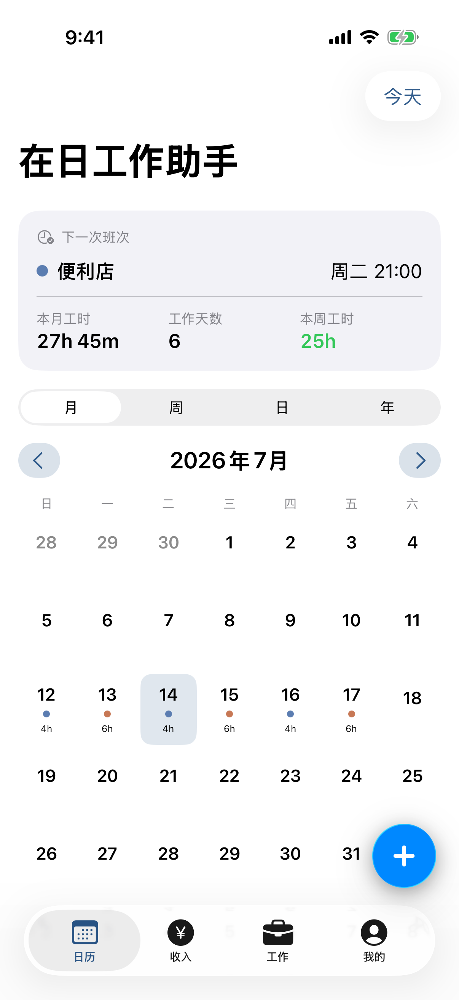
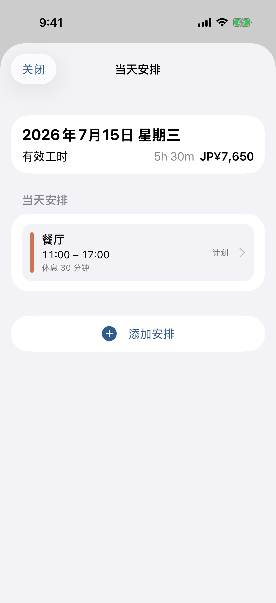
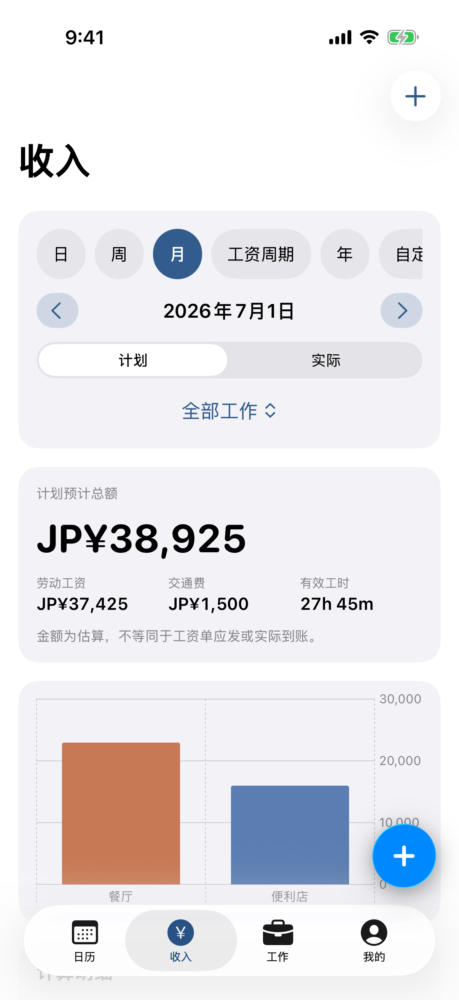
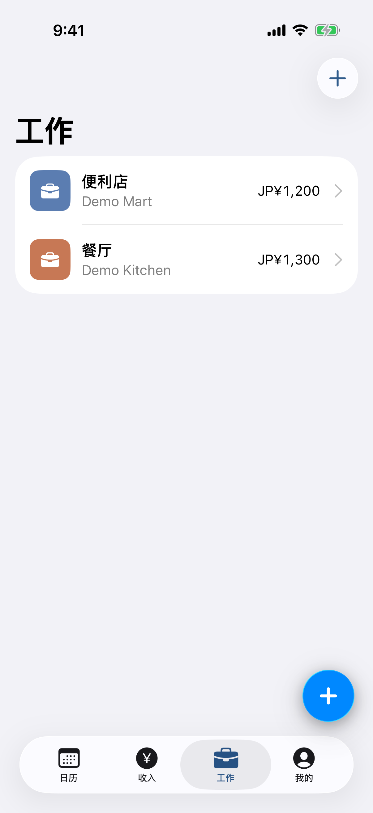

# ShiftLog Japan

在日工作助手（バイトログ）是一款面向在日留学生和外国劳动者的本地优先 iOS 班次、工时与工资管理 App。它支持同时管理多份工作，并以简体中文、日本語和 English 提供完整界面。

[产品官网](https://ytsakura233.github.io/shiftlog-japan-ios/) · [隐私说明](website/privacy.html) · [安全报告](SECURITY.md) · [贡献指南](CONTRIBUTING.md)

> App 中的工时、工资、最低工资与许可提示只用于记录、估算和风险提醒，不构成法律、税务或行政建议。

<p align="center">
  
  
  
  
</p>

## 主要功能

- 多工作管理：工作资料、时薪历史、默认班次、交通费、取整、工资周期、发薪日与深夜加薪。
- 班次记录：计划与实际时间、多段休息、跨日班次、重复班次、复制、系列编辑和冲突检查。
- 日历与收入：月、周、日、年视图；按日期、工资周期或自定义范围统计工时与工资。
- 工时提醒：合并多份工作的周工时，并根据用户自行设置的上限提示风险。
- 工资核对：区分预计工资、工资单应发、扣除项目与实际到账金额。
- 工作资料：在 App 私有目录保存照片或 PDF，并使用设备端 OCR 生成可编辑草稿。
- 本地辅助：地域最低工资参考、证件日期提醒、官方帮助入口和三语工资单词汇。
- 数据控制：SwiftData 本地保存、JSON 完整备份与恢复、UTF-8 BOM CSV 导出。
- 系统集成：可选本地通知、独立系统日历单向同步，以及 Face ID／设备密码隐私锁。
- 三语界面：首次设置和后续页面可即时切换简体中文、日文和英文。

## 隐私设计

当前版本不要求账号，不连接开发者业务服务器，也不集成分析、追踪、广告 SDK 或第三方业务 API。班次、工资、证件提醒和附件默认保存在用户设备上。用户主动导出的备份和 CSV 由用户自行决定保存位置与分享对象。

权限均为可选：通知用于班次、发薪日和证件日期提醒；日历用于维护 App 创建的独立日历；Face ID 或设备密码只在用户开启隐私锁后使用。照片通过系统选择器逐项选择，App 不申请读取整个照片图库。

更完整的说明见 [官网隐私页面](website/privacy.html) 和随 App 打包的 `PrivacyInfo.xcprivacy`。

## 开发环境

- Xcode 26 或更新版本
- Swift 6
- iOS 18.0 或更新版本
- SwiftUI、SwiftData、Charts、EventKit、UserNotifications、Vision、PDFKit、LocalAuthentication 和 StoreKit 2

工程不依赖第三方软件包。

## 本地运行

1. 使用 Xcode 打开 `ShiftLogJapan.xcodeproj`。
2. 选择 `ShiftLogJapan` scheme 和一个 iPhone 模拟器。
3. 直接运行；模拟器不需要代码签名。
4. 真机运行前，在 Signing & Capabilities 中选择自己的 Team，并把示例 Bundle ID `com.example.shiftlogjapan` 改成自己的标识。

命令行无签名构建：

```sh
xcodebuild -project ShiftLogJapan.xcodeproj \
  -scheme ShiftLogJapan \
  -destination 'generic/platform=iOS' \
  -derivedDataPath /tmp/ShiftLogDerived \
  CODE_SIGNING_ALLOWED=NO build
```

## 项目结构

```text
ShiftLogJapan/
├── App/                 启动、首次设置与主导航
├── CoreModels/          SwiftData 本地模型
├── CalculationEngine/   工时、工资、冲突与风险计算
├── Features/            Calendar、Shifts、Jobs、Earnings 等界面
├── Compliance/          最低工资版本与证件提醒规则
├── Documents/           私有文件存储与设备端 OCR
├── Persistence/         JSON、CSV、恢复与演示数据
├── SystemServices/      EventKit 与 UserNotifications 封装
├── Monetization/        默认关闭的广告与 StoreKit 2 接口
└── DesignSystem/        本地化、主题、格式与系统视觉降级
```

计算层不依赖界面。时间按整数分钟累计，货币使用 `Decimal`；跨午夜加薪按分钟边界计算，休息时间不产生基本工资或加薪。详细规则见 [计算规则](Docs/CalculationRules.md)。

## 测试

单元测试覆盖工资、加薪、取整、多段休息、跨日班次、冲突、周工时、工资周期、日期联动、时薪历史、最低工资选版、证件提醒和本地化回退。UI 测试覆盖三语首次设置、日历新增、表单校验、收入范围和 P1 功能入口。

```sh
xcodebuild -project ShiftLogJapan.xcodeproj \
  -scheme ShiftLogJapan \
  -destination 'platform=iOS Simulator,name=iPhone 17 Pro' \
  -derivedDataPath /tmp/ShiftLogDerived \
  test
```

最近一次完整验证环境为 Xcode 26.6、iPhone 17 Pro / iOS 26.5：25 项单元测试和 8 项 UI 测试通过。

## 发布前配置

- 替换 App、单元测试和 UI 测试目标中的示例 Bundle ID，并选择自己的开发 Team。
- 商业化总开关默认关闭。启用 StoreKit 前，请替换 `AppConfiguration` 中的示例产品 ID，并完成 App Store Connect、StoreKit Configuration、购买恢复和审核测试。
- 工程当前未启用 CloudKit entitlement。启用跨设备同步前，需要完成数据迁移、冲突处理、软删除和双设备恢复测试。
- 发布新版前应复核 App 内官方链接、制度说明日期、最低工资数据与隐私声明。
- 不要提交真实用户数据、备份、签名材料、开发者 Team、私有产品 ID 或软著申请资料；相关本地文件已由 `.gitignore` 排除。
- 仓库公开前，在 GitHub 的 Code security 设置中开启 Private vulnerability reporting，确保安全问题可以私下提交。

## 官网

`website/` 是不依赖后端的静态官网，包含中、日、英三语首页、隐私页、支持页和真实 App 截图。`main` 分支的网站文件变化会通过 GitHub Actions 部署到 GitHub Pages。

首次启用时，请在仓库 **Settings → Pages → Build and deployment → Source** 中选择 **GitHub Actions**。本地预览可运行：

```sh
python3 -m http.server 4173 --directory website
```

## 后续计划

- CloudKit 私有数据库同步、同步状态和冲突合并。
- 锁屏／桌面小组件、繁体中文和 PDF 月报。
- OCR 字段级辅助映射。
- 完整 StoreKit 测试配置与订阅购买页面。
- 更灵活的重复排班和工资周期规则。

当前实现状态见 [功能完成情况](Docs/CompletionStatus.md)。

## 贡献与许可

欢迎通过 Issue 提交已去除个人信息的问题报告。准备贡献代码前，请阅读 [贡献指南](CONTRIBUTING.md)；安全或隐私问题请按照 [安全说明](SECURITY.md) 私下报告。

本仓库当前为源码公开查看版本，并非开放源代码许可。除非获得版权所有者的书面许可，不得复制、修改、分发或用于派生作品，详见 [LICENSE](LICENSE)。如果项目后续决定采用 MIT、Apache-2.0 等开放源代码许可，将通过单独提交明确变更。
